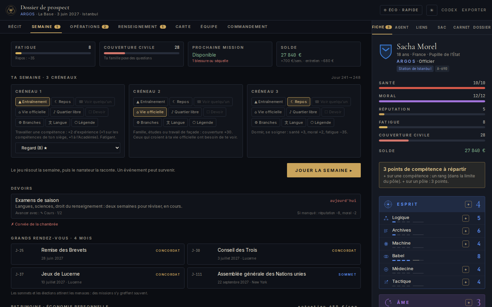
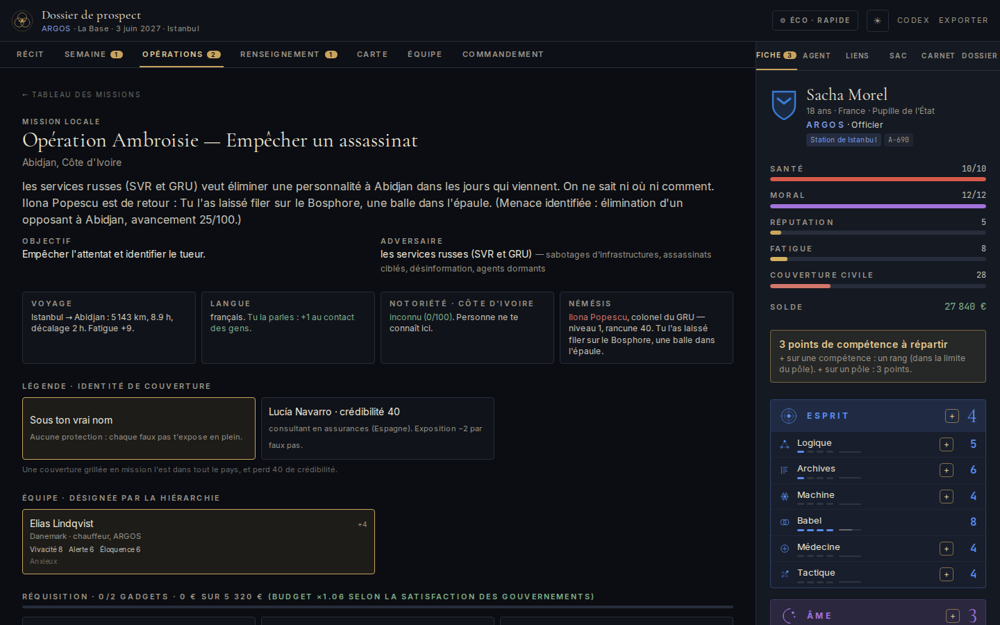
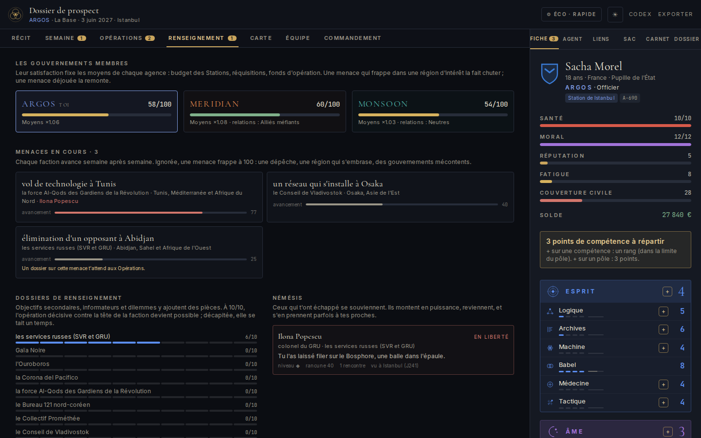
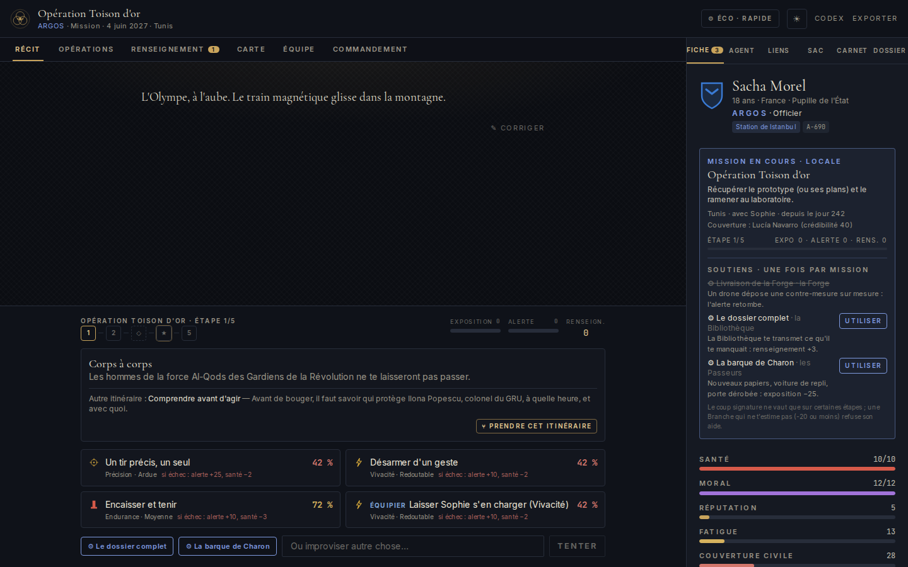
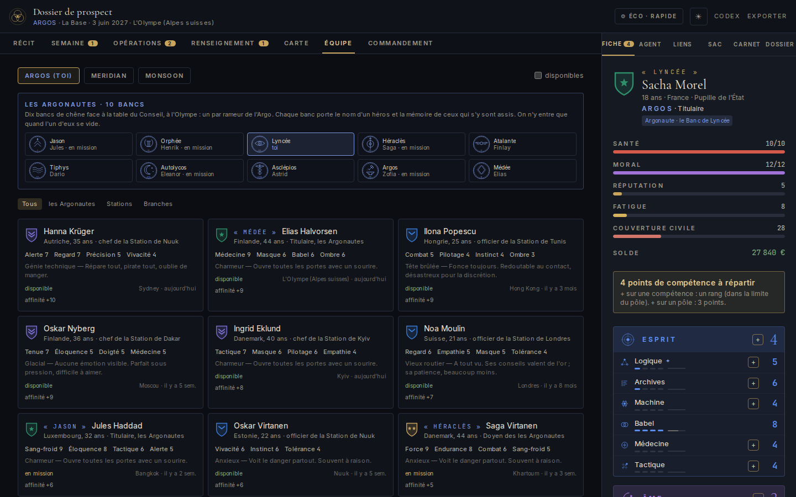
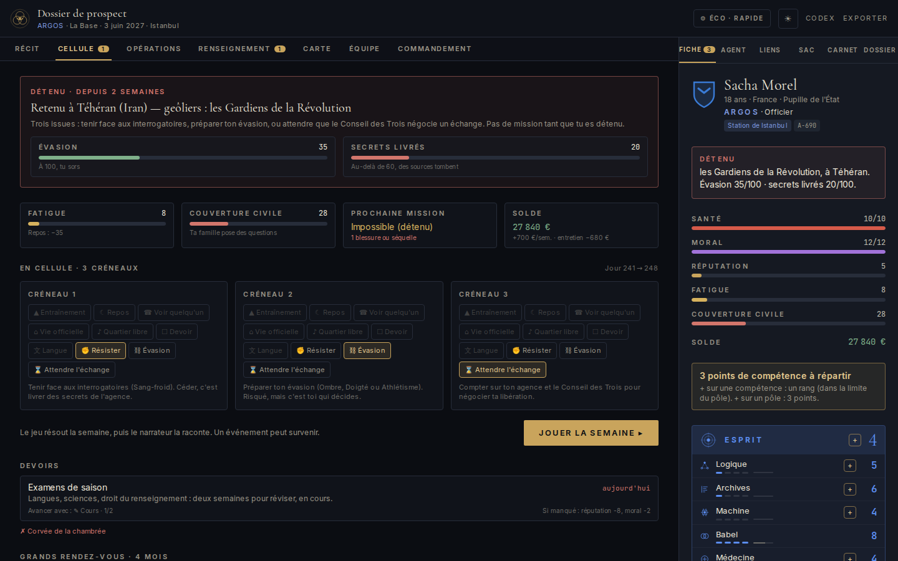
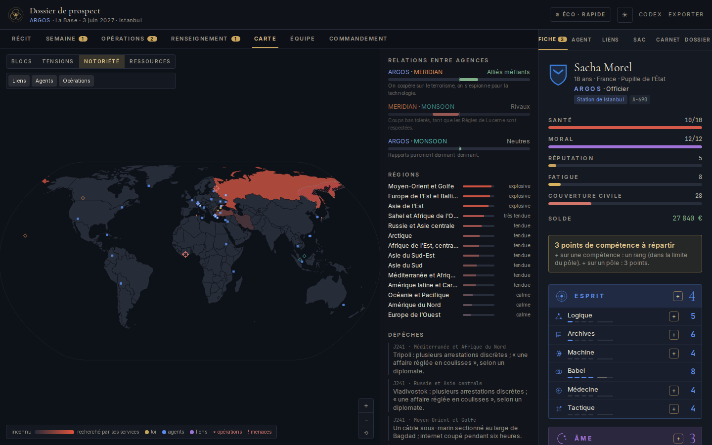
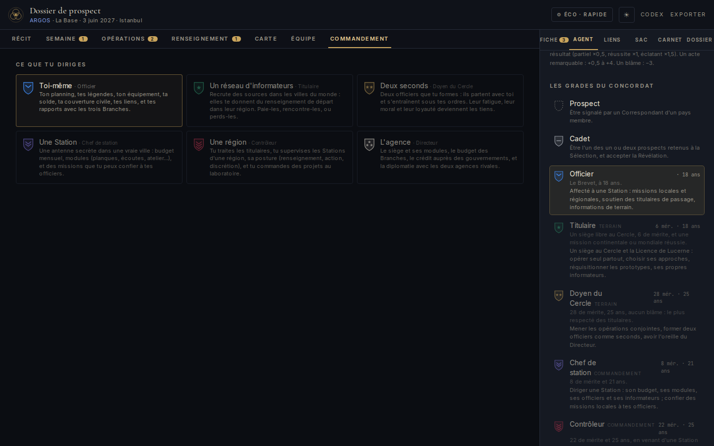

# LUCERNE v4 — cahier des charges

Validé par le joueur le 2026-10-05. Le moteur décide, l'IA raconte chaque résultat.

## 1. Organisation (identique pour les trois agences, noms propres à chacune)
- **Direction** : le Directeur (le « M ») et son Second.
- **Le Cercle** : l'élite de terrain, sièges numérotés et nommés, chacun avec une tradition, une spécialité et un coup signature (une fois par mission).
  ARGOS : les Argonautes (10 bancs) · MERIDIAN : la Constellation (10 étoiles) · MONSOON : les Huit Vents (8).
  Un siège se libère (retraite, mort, disgrâce) environ une fois par an ; un officier méritant le prend, sinon un rival.
- **Stations** : une dizaine d'antennes secrètes par agence dans de vraies villes (chef de station, officiers, informateurs).
- **Trois Branches** (soutien, on ne les rejoint pas ; chacune a un chef, personnage avec qui on entretient une relation) :
  Laboratoire (la Forge / le Hangar / l'Atelier des Vents), Analyse (la Bibliothèque / Mission Control / la Ruche),
  Logistique (les Passeurs / Ground Crew / les Marées). En mission, on peut solliciter chaque Branche une fois si la relation le permet.
- **Académie** : une dizaine de cadets en tout, tous âges confondus.
- Les Divisions (Maisons, Wings, Écoles) disparaissent : la spécialisation vient de la **Station d'affectation** (expertise régionale) et du **Siège**.

## 2. Grades
Prospect → Cadet → Officier, puis deux voies :
- terrain : Officier → **Titulaire** (un siège) → **Doyen du Cercle** ;
- commandement : Officier → **Chef de station** → **Contrôleur** (traite les titulaires, commande des projets au labo, supervise une région) → **Directeur**.
Passerelle : un titulaire ou doyen peut devenir Contrôleur. Directeur : il faut avoir siégé au Cercle et commandé.

## 3. Sélection et Académie
Sélection : une soixantaine de prospects, 1 ou 2 retenus. Académie : ~10 cadets (la chambrée est toute l'Académie), brassards, examens, Opérations Jeunesse.

## 4. Missions
- **Carte à embranchements** : à certaines étapes, deux itinéraires ; des **objectifs secondaires** facultatifs (mérite, pièces de dossier).
- **Némésis** : méchants et agents rivaux nommés qui survivent, se souviennent, montent en puissance et reviennent.
- **Légendes** (identités de couverture) : créées et entretenues, crédibilité, grillées par l'exposition ; une légende grillée l'est dans le pays.
- **Fiché par pays** : notoriété auprès des services de chaque pays ; elle monte avec le bruit, baisse avec le temps, rend les retours dangereux.
- **Blessures et séquelles** : blessures précises avec malus et durée de guérison, séquelles permanentes rares, cicatrices.
- **Voyages et logistique** : trajets (temps, coût, décalage horaire, fatigue) ; insertion clandestine en pays hostile.
- **Langues** : parler la langue du pays aide en mission ; on en apprend au planning.
- **Conséquences légales** : arrestation, prison (interrogatoires, évasion, échange au Conseil des Trois), expulsion.

## 5. Vie hors mission
Planning hebdomadaire (3 créneaux), devoirs, liens, couverture civile, fatigue, récupération.
**Économie personnelle** : logement, véhicule, garde-robe, cours, aide à la famille (prix, entretien, effets).
**Grands rendez-vous** : Jeux de Lucerne (épreuves réelles), Conseil des Trois (trimestriel), examens, remise des Brevets ; **calendrier réel** (Davos, Conférence de Munich, Assemblée générale de l'ONU, G20, élections…).

## 6. Monde vivant
- **Les factions agissent** : chaque menace avance semaine après semaine ; ignorée, elle frappe (dépêche, tension, discrédit).
- **Les agences rivales agissent** : leurs titulaires ont leurs missions (succès, échecs, morts), on les croise, on se double, on échange des prisonniers.
- **Dossiers de renseignement** par faction : complets, ils débloquent la mission décisive contre sa tête.
- **Budget lié aux gouvernements** : la satisfaction des pays membres fixe les moyens de l'agence.

## 7. État d'avancement

Avant la v4 : monde réel + carte, planning, devoirs, missions par étapes avec jauges, gadgets, effectif, commandement, narration des résultats par l'IA, migration des sauvegardes.

La v4 est en place dans le moteur (`npx tsx scripts/engine-test.ts`) **et dans les écrans** :

| § | Ce qui est demandé | Où le voir |
|---|---|---|
| 1 | Cercle et sièges nommés, Stations, trois Branches et leurs chefs, Académie | **Équipe** (tableau du Cercle, filtres Cercle / Stations / Branches, chambrée) · **Fiche › Agent › Organisation** (siège ou Station, estime de chaque Branche) · **Codex** |
| 2 | Deux voies après Officier, passerelle, conditions du Directeur | **Fiche › Agent** (les deux voies et ce qui manque) · **cérémonie** (choix de la Station au Brevet, du siège pour un titulaire) · **Commandement** (ce que chaque grade dirige) |
| 3 | Sélection, Académie, Opérations Jeunesse | Onglet **Académie** · **Équipe › Ta chambrée** |
| 4 | Carte à embranchements, objectifs secondaires | **Console de mission** : « ⑂ Prendre cet itinéraire », étapes ◇ facultatives |
| 4 | Némésis | **Renseignement › Némésis** · fiche de préparation |
| 4 | Légendes | Planning (« Légende ») · **préparation** (choix de la couverture, grillée par pays) · **Fiche › Agent › Légendes** |
| 4 | Fiché par pays | **Fiche › Agent › Fiché par pays** · **Carte › notoriété** · préparation |
| 4 | Blessures et séquelles | **Fiche** (malus sur les compétences, guérison) |
| 4 | Voyages, insertion clandestine, langues | **Préparation** (voyage, décalage, fatigue, langue, territoire hostile) · planning (« Langue ») · **Fiche › Langues** |
| 4 | Arrestation, prison, évasion, échange | Onglet **Cellule** (évasion, secrets livrés, planning de détention) |
| 4 | Soutien des Branches une fois par mission, si la relation le permet | **Console** et **Fiche › Mission** (refusé en dessous de −20 d'estime) |
| 5 | Planning, devoirs, économie personnelle, grands rendez-vous | **Semaine** : Patrimoine (acheter, revendre, entretien), Grands rendez-vous (calendrier réel et Concordat) |
| 6 | Factions qui agissent, rivales, dossiers, budget lié aux gouvernements | **Renseignement** (satisfaction et moyens, menaces, dossiers par faction, les trois Cercles) · **Carte** (menaces « ! ») |

Correctifs du moteur faits au passage : plafond d'informateurs aux grades v4, légende enfin transmise au départ en mission, soutien de Branche conditionné à son estime.

Reste à faire, hors cahier des charges :
- `exemples/sauvegarde-demo-sacha.json` est une sauvegarde v2 : le jeu ne la lit plus.
- Le `README.md` décrit encore SÉRAPHIN (cravates, Salons, Divisions) et pas le Concordat.

### Captures

| | |
|---|---|
|  |  |
|  |  |
|  |  |
|  |  |
